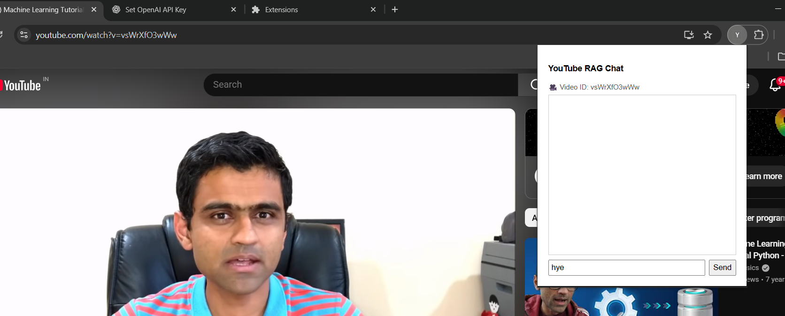
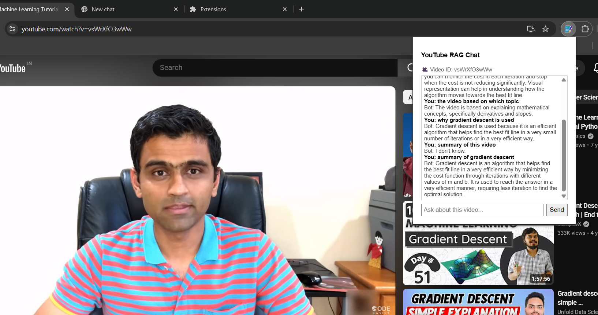

# 🎥 YouTube RAG Chat Extension

Chat with any YouTube video using **Retrieval‑Augmented Generation (RAG)**. This Chrome extension extracts the video transcript, builds embeddings, and lets you ask natural‑language questions about the video content — all in real time.

---

## ✨ Features

* 🔍 Ask questions about the **currently open YouTube video**
* 📄 Automatically fetches **YouTube transcripts**
* 🧠 Uses **RAG (FAISS + OpenAI embeddings)** for accurate answers
* 💬 Clean chat UI inside a Chrome extension
* 🧹 Chat history stored **temporarily (in‑memory)**
* ⚡ Works with Shorts, standard videos, and youtu.be links

---

## 🏗️ Tech Stack

### Frontend (Chrome Extension)

* JavaScript (Vanilla)
* HTML / CSS
* Chrome Extension APIs (Manifest V3)

### Backend (RAG API)

* Python + Flask
* youtube‑transcript‑api
* LangChain
* FAISS Vector Store
* OpenAI API

---

## 📁 Project Structure

```
.
├── extension/
│   ├── manifest.json
│   ├── popup.html
│   ├── popup.js
│   ├── popup.css
│   ├── background.js
│   ├── icons/
│   │   ├── icon16.png
│   │   ├── icon32.png
│   │   ├── icon48.png
│   │   └── icon128.png
│
├── backend/
│   ├── app.py
│   ├── myRag.py
│   ├── requirements.txt
│   └── .env
│
└── README.md
```

---

## 🚀 How It Works

1. User opens a YouTube video
2. Extension extracts the **video ID**
3. User asks a question in the popup
4. Backend:

   * Fetches transcript
   * Splits text into chunks
   * Generates embeddings
   * Stores them in FAISS
   * Retrieves relevant context
   * Sends context + question to LLM
5. Answer is returned and shown in the extension UI

---

## 🛠️ Setup Instructions

### 1️⃣ Backend Setup (Flask API)

#### Install dependencies

```bash
pip install -r requirements.txt
```

#### Create `.env` file

```env
OPENAI_API_KEY=your_openai_api_key
```

#### Run the backend

```bash
python app.py
```

Backend will run at:

```
http://127.0.0.1:5000
```

---

### 2️⃣ Chrome Extension Setup

1. Open Chrome and go to:

```
chrome://extensions
```

2. Enable **Developer Mode**
3. Click **Load unpacked**
4. Select the `extension/` folder
5. Pin the extension

---

## 🧪 Usage

1. Open any YouTube video
2. Click the **YouTube RAG Chat** extension icon
3. Ask a question about the video
4. Get an AI‑generated answer based on the transcript

---

## ⚠️ Limitations

* ❌ Does not work if transcript is disabled
* 🐌 Embeddings are regenerated per query (can be optimized)
* 💾 Chat history is not persisted

---

## 🔮 Future Improvements

* ✅ Cache embeddings per video
* ⏱️ Add timestamp‑based answers
* 💾 Persist chat history per video
* 📌 Sidebar integration
* 🌐 Deployment with Docker / Cloud

---

## 📸 Screenshots

>




---

## 🤝 Contributing

Contributions are welcome!

1. Fork the repo
2. Create a feature branch
3. Commit your changes
4. Open a Pull Request

---

## 📄 License

MIT License

---

## 🙌 Acknowledgements

* OpenAI
* LangChain
* YouTube Transcript API
* FAISS

---

⭐ If you like this project, consider giving it a star!
